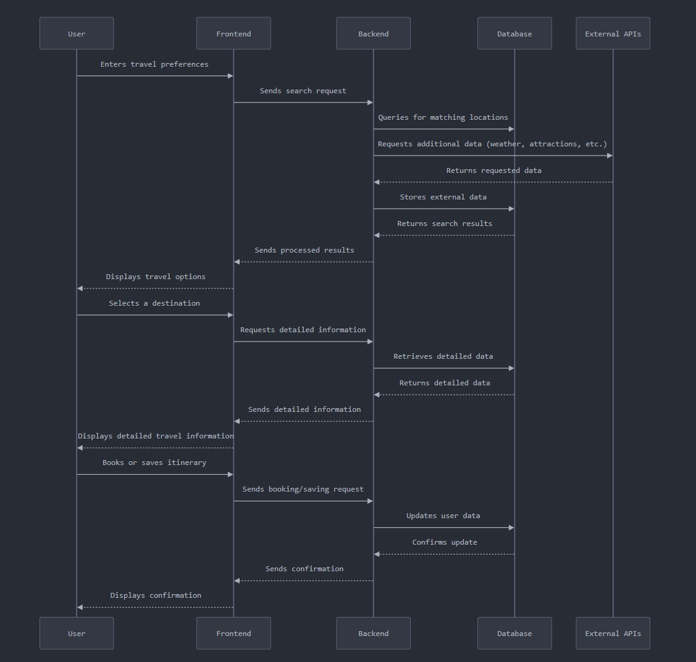
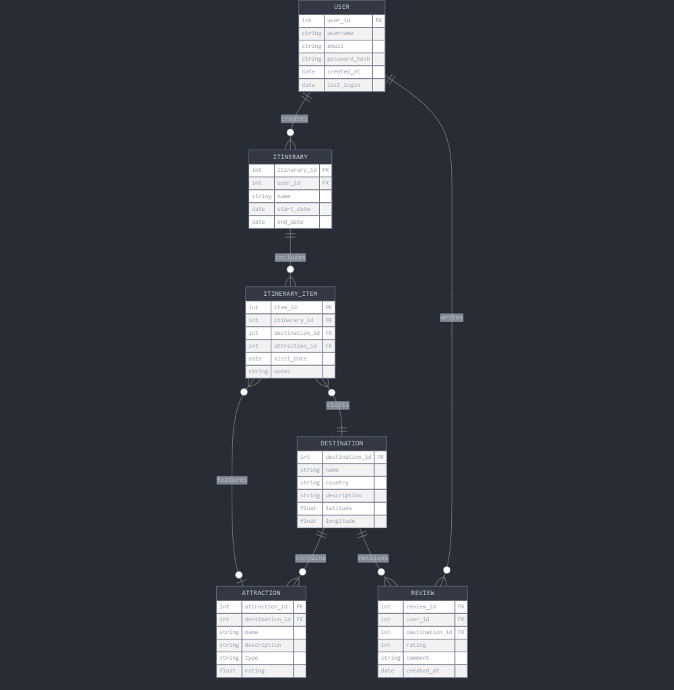

# Trip-E-Duniya

A **Travel Assistant Website** where users can search for places to visit based on their preferences, filters, and interests. The goal is to provide personalized travel recommendations, ensuring that users find destinations that match their criteria seamlessly.

---

## Table of Contents

- [Introduction](#introduction)
- [Process Flow](#process-flow)
- [Database Design](#database-design)
- [Features](#features)
- [Tech Stack](#tech-stack)
- [How to Contribute](#contributing)

---

## Introduction

Welcome to the **Travel Assistant Website** repository! This project aims to enhance the travel planning experience by offering users a platform where they can explore travel destinations based on custom filters such as location, budget, interests, and other preferences. The application is user-friendly and designed to streamline the process of discovering the best places to visit.

---

## Process Flow

Here’s a high-level view of how the Travel Assistant website works:



- [Link](https://claude.site/artifacts/ebb92674-499b-4ddc-8b0e-662b81218bce)

## Travel Search and Booking Flow

### 1. User Input

- **Action:** User enters travel preferences
- **Details:** The user provides their preferences for travel, such as location, dates, budget, etc.

### 2. Frontend

- **Action:** Sends search request
- **Details:** The frontend sends the search request to the backend based on the user’s input.

### 3. Backend

- **Action:** Queries matching locations
- **Details:** The backend queries the database to find locations that match the user's preferences.
- **Action:** Requests additional data
- **Details:** The backend also requests data from external APIs to gather information such as weather, attractions, etc.
- **Action:** Returns processed data
- **Details:** Once all relevant data is gathered, it is sent back to the frontend.

### 4. Frontend

- **Action:** Displays travel options
- **Details:** The frontend displays travel options to the user based on the processed data received from the backend.

### 5. User Selection

- **Action:** User selects a destination
- **Details:** The user selects a destination of interest from the available travel options.

### 6. Frontend

- **Action:** Requests detailed information
- **Details:** After selecting a destination, the frontend requests detailed travel information from the backend.

### 7. Backend

- **Action:** Retrieves detailed data
- **Details:** The backend retrieves additional data for the selected destination from the database and external APIs (if necessary).
- **Action:** Returns detailed data
- **Details:** The backend sends the retrieved data back to the frontend.

### 8. Frontend

- **Action:** Displays detailed travel information
- **Details:** The frontend displays detailed information about the selected destination to the user.

### 9. User Action

- **Action:** User books or saves the itinerary
- **Details:** The user chooses to either book the travel itinerary or save it for later.

### 10. Frontend

- **Action:** Sends booking/saving request
- **Details:** The frontend sends a booking or saving request to the backend.

### 11. Backend

- **Action:** Updates user data
- **Details:** The backend processes the booking or saves the itinerary and updates the user’s travel data in the database.
- **Action:** Confirms update
- **Details:** Once the booking or saving process is complete, a confirmation is sent back to the frontend.

### 12. Frontend

- **Action:** Displays confirmation
- **Details:** The frontend shows a confirmation to the user, completing the travel search and booking flow.

---

## Database Design



- [Link](https://claude.site/artifacts/ca996647-d906-4a4d-997c-13daaaae01ad)

---

## Features

- **Custom Filters**: Users can filter destinations by location, interests, budget, season, etc.
- **Personalized Recommendations**: Tailored destination suggestions based on user preferences.
- **Details on Destinations**: Information about each destination including attractions, activities, and more.
- **Interactive Map**: A map that shows the location of recommended destinations.
- **User-Friendly Interface**: Simple and intuitive user interface for a seamless experience.

---

## Tech Stack

- **Frontend**: HTML, CSS, JavaScript, ReactJS
- **Backend**: Node.js, Express.js
- **Database**: MongoDB/Firebase
- **Version Control**: Git & GitHub
- **APIs**: Google Maps API, Travel Recommendation APIs

---

## Contributing

We welcome contributions from the community! To contribute to this project, follow these steps:

## 1. Initial Setup

### Clone the Repository

In your local machine, open the folder where you want to keep the project, open the terminal and run the following command:

```bash
https://github.com/UditJain2622004/Trip-E-Duniya.git
```

## 2. Contributing to the Repository

### (To be done in VSCode)

#### 2.1 Update Your Local Repository

**Pull the Latest Changes:** Before you start making changes, ensure your local repository is up-to-date with the remote repository:

```bash
   git pull origin main
```

#### 2.2 Create a new branch/Move to your feature branch

Make all the changes in a new branch. If starting a new feature, create a new branch.

```bash
   git checkout -b your-branch-name
```

If you already have a branch, move to it.

```bash
   git checkout branch-name
```

#### 2.3 Making Changes

1. **Edit Files:** Make your changes to the code or documentation as needed.
2. **Stage Your Changes:** After you are done with your changes, add the files you modified to the staging area:

```bash
   git add .
```

3. **Commit Your Changes:** Commit your changes with a descriptive message:

```bash
   git commit -m "Your commit message describing the changes"
```

4. **Push your branch:** Push your branch to the remote repository:

```bash
   git push origin your-branch-name
```

## 3. Create a Pull Request

1. **Go to GitHub:** Open the repository page on **GitHub**.
2. **Create a Pull Request:** You will usually see a prompt to create a pull request for your recently pushed branch. Click on **Compare & pull request**.
3. **Fill in Details:** Provide a title and description for your pull request, explaining the changes you made.
4. **Submit Pull Request:** Click on **Create pull request** to submit it for review.
